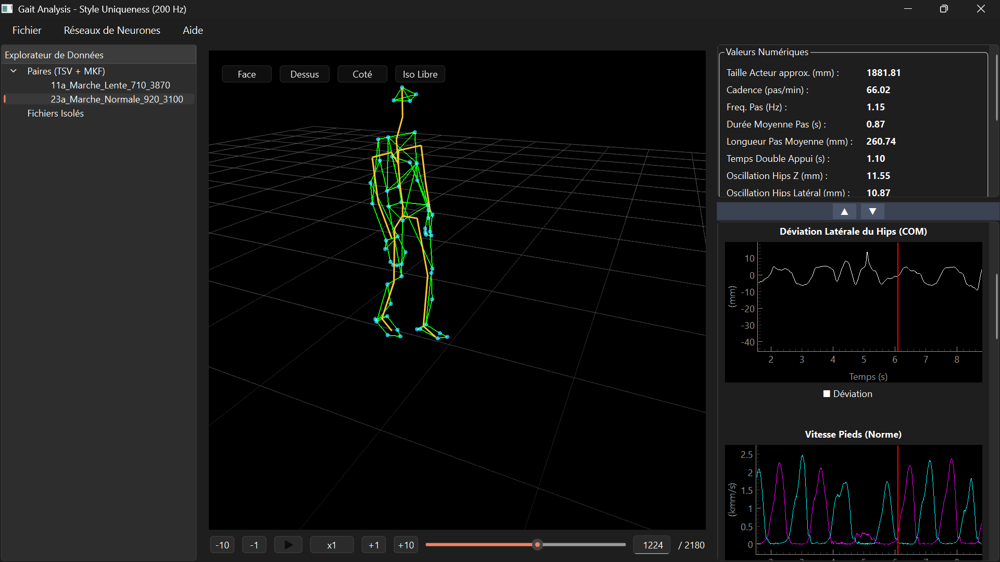

# 🚶‍♂️ Gait Analysis & Style Uniqueness : Identification Biométrique par la Marche


> *"Le style est une caractéristique biométrique à chaque individu."*  
> — **Caroline Larboulette**, Enseignante-Chercheuse à l'UBS de Vannes.



## 🔬 Contexte Scientifique et Objectifs

Ce dépôt s'inscrit dans le cadre d'un projet de recherche innovant à l'initiative de **Caroline Larboulette** (Université Bretagne Sud - Vannes). L'objectif de cette étude est d'analyser, de quantifier et de prouver l'unicité de la démarche humaine (Gait Analysis). 

Pour mener à bien cette recherche, nous avons constitué **notre propre base de données de Motion Capture (MoCap)** en utilisant du matériel de pointe **Qualisys**. L'étude complète porte sur une cohorte de 9 acteurs effectuant différents parcours de marche.

**Objectif final (Évolution prévue) :** Implémenter une architecture de réseaux de neurones (Deep Learning) capable d'apprendre les signatures biomécaniques de chaque style de marche afin de classifier et d'identifier avec précision les 9 acteurs de notre base de données.

---

## 📂 Organisation des Données (Répertoire `Data`)

L'application traite des paires de fichiers synchronisés à haute fréquence (200 Hz) :
*   **`.TSV`** : Coordonnées 3D brutes des marqueurs anatomiques placés sur la peau de l'acteur.
*   **`.MKF`** : Squelette résolu (Joints) modélisant l'ossature et les centres articulaires.

⚠️ **Note sur la confidentialité des données :** 
Le répertoire `Data` fourni dans ce dépôt public ne contient **que les données me concernant personnellement** (actuellement 1 paire de fichiers), puisque j'ai participé aux sessions d'enregistrement en tant qu'acteur. Le reste de la base de données (incluant les 8 autres acteurs) reste strictement confidentiel à des fins de recherche.

---

## 🛠 L'Application : `mocap_app.py`

Le cœur technique de ce dépôt est l'application **`mocap_app.py`**, un outil d'analyse et de visualisation développé en Python visant à extraire les features nécessaires au futur réseau de neurones.

### ✨ Fonctionnalités Principales :
*   **Visualisation 3D Hautes Performances :** Rendu fluide à 200 Hz avec OpenGL. Affichage de l'enveloppe corporelle (marqueurs TSV triangulés) et du squelette (MKF), avec contrôles de caméra (panoramique, zoom, vues standards).
*   **Calcul de Descripteurs Biomécaniques Avancés :** Traitement du signal (Filtres de Savitzky-Golay, Butterworth) pour extraire dynamiquement :
    *   *Spatio-temporels* : Cadence, longueur de pas, temps de double appui.
    *   *Cinématiques* : Vitesse, Accélération, et Jerk 3D.
    *   *Angulaires* : Angle d'attaque du talon (Heel strike), angles de flexion continus (hanches, genoux, chevilles).
    *   *Stabilité* : Oscillation et déviation latérale du Centre de Masse (COM).
*   **Interface Analytique Synchronisée :** Navigation dans la timeline 3D parfaitement synchronisée avec les graphiques 2D des séries temporelles.
*   **Génération de Rapports :** Export direct de la séquence en PDF scientifique, incluant les descripteurs numériques (scalaires) et les graphes analytiques de la marche.

---

## 💻 Installation et Utilisation

### Prérequis
Assurez-vous d'avoir Python 3.10+ installé. Le projet utilise des bibliothèques standard de data science et de rendu graphique.

```bash
# Cloner le dépôt
git clone https://github.com/Rbyaarnrault/3D_Skeleton_Visualizer.git
cd 3D_Skeleton_Visualizer

# Installer les dépendances
pip install PyQt6 pyqtgraph numpy scipy PyOpenGL PyOpenGL_accelerate
